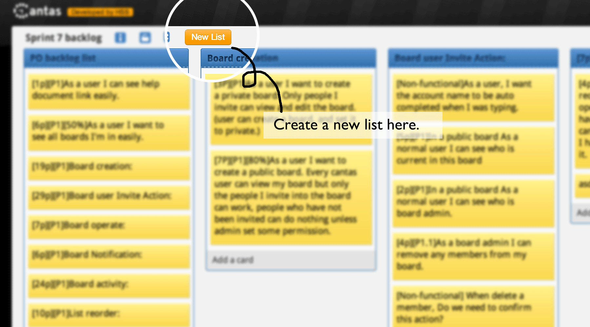

# Cantas

Cantas is a real-time collaborative Web application built upon [Node.js][nodejs] and [Socket.IO][socketio].

[](http://travis-ci.org/onepiecejs/nodejs-cantas)

Thanks for [all Contributors](AUTHORS.md)



# Getting started

## Demo Site - Deployed on OpenShift

http://cantas-onepiecejs.rhcloud.com/

Login with your Google account.

## Deploy to OpenShift.

```bash
rhc domain create <yournamespace>
rhc app create cantas nodejs-0.10 -s
cd cantas/
rhc cartridge add mongodb-2.4 -a cantas
rhc cartridge add "http://cartreflect-claytondev.rhcloud.com/reflect?github=smarterclayton/openshift-redis-cart" -a cantas
git remote add upstream -m master git@github.com:onepiecejs/nodejs-cantas.git
git pull -s recursive -X theirs upstream master
git push
rhc env set NODE_ENV=production -a cantas
# Caution: please input your variabes in .openshift/lib/init_settings
rhc app restart -a cantas
```

> ***Note:***
> Openshift instructions need updating
> Please update your settings value in .openshift/lib/init_settings before push
> to Openshift Online service.

## Setup development environment with one-click.

Installing [Vagrant](https://www.vagrantup.com) with your package manager,

    sudo yum install vagrant

Then run the up command in the root of the project's directory,

    vagrant up

> ***Note:***
> If you are on Fedora 22, you will need to install the "libvirt" lib's to run Vagrant from the "vagrantfile" supplied in the root of the Cantas app directory.
> dnf install libvirt vagrant-libvirt


## Setup development environment manually.

- install [Nodejs][nodejs], [npm][npm], [MongoDB][MongoDB], [Redis][Redis].

    ```bash
    # nodejs & npm
    wget http://nodejs.org/dist/v0.10.22/node-v0.10.22.tar.gz
    tar -xvf node-v0.10.22.tar.gz
    cd node-v0.10.22
    ./configure && make
    sudo make install
    
    # mongo
    sudo yum install mongodb mongodb-server
    # redis
    sudo yum install redis

    #Fedora 22
    dnf install nodejs

    #Ubuntu 14+ (Only tested against 14)
    sudo apt-get install nodejs build-essential

    #Red Hat 6+ and Centos 6+
    yum install epel-release
    yum install nodejs

    #NPM
    NPM should be installed as part of the nodejs packages for Fedora, Red Hat, Centos and Ubuntu.
    ```

> ***Note:***
> If you got `g++: command not found` while installing nodejs,
> you can install it by `sudo yum install gcc-c++`.


- Kerberos requirements:

> ***Note:***
> If you plan to use Kerberos authentication install the relevant kerberos libraries for your distro.

    sudo yum install -y krb5-devel krb5-libs krb5-workstation


- checkout cantas source code and update node packages via npm

    ```bash
    git clone git@github.com:onepiecejs/nodejs-cantas.git
    cd nodejs-cantas
    npm install
    ```

- start redis server and mongodb server

    ```bash
    # if you have installed them as services, do
    sudo systemctl start redis
    sudo systemctl start mongod
    # or
    sudo service redis start
    sudo service mongod start
    ```
    ```bash
    # otherwise,
    redis-server &
    && mongod --dbpath=/tmp &
    ```

- start the app

    ```bash
    # update 'settings.json' file
    cp settings.json.example settings.json

    # setup initalize data
    node scripts/migrations/initLabelMetadata.js

    # start the app
    NODE_ENV=development node app.js
    ```

- for development convenience the following steps will make logging in easy while you are developing

    Edit `settings.json` and change `auth.default` to `local`, then add a user.
    If `local` doesn't work try `dummy` as the `auth.default` strategy and then add a user.

    ```
    node scripts/addUser.js cantas cantas
    ```

> ***Note:***
> Make sure the `mongod` deamon is running before starting the app.
> To enable Google signin you will need to create a Client ID in the [Google Developer Console](https://console.developers.google.com).


That's it. Open your browser at `http://localhost:3000` and log into Cantas.


## Resources

- [HTML5 pushState](http://diveintohtml5.info/history.html)

## Integration && Test Environment

- [Grunt task to run jasmine unit tests through phantomjs](https://github.com/jasmine-contrib/grunt-jasmine-runner)

### Dependencies

- [Node.js][nodejs]
- [npm][npm]
- [Backbone.js](http://backbonejs.org/)
- [Socket.IO][socketio]
- [Redis][Redis]
- [Mongo][MongoDB]

### Template engine

- [Jade](https://github.com/visionmedia/jade)

  [nodejs]:http://nodejs.org/    "Nodejs"
  [npm]:http://npmjs.org/    "npm"
  [Redis]:http://redis.io/ "Redis"
  [MongoDB]:http://www.mongodb.org/ "MongoDB"
  [socketio]:http://socket.io/
